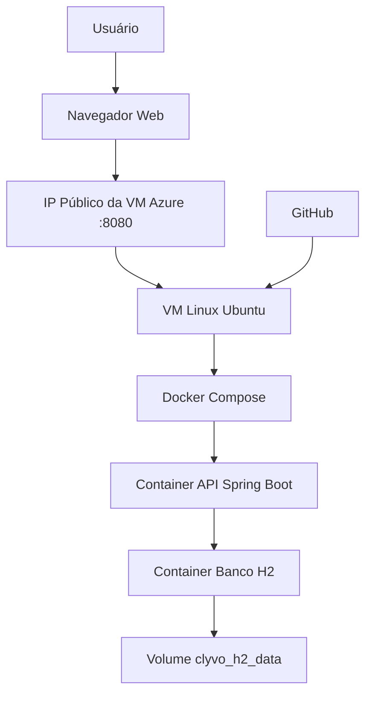

# Clyvo PetCare - DevOps

API REST desenvolvida em Java com Spring Boot para apoiar a continuidade do cuidado veterinário, permitindo o cadastro de pets e a criação de alertas preventivos vinculados a cada animal.

## Descrição do Projeto

O Clyvo PetCare permite cadastrar pets e criar alertas preventivos relacionados a check-ups, vacinação, acompanhamento clínico, controle alimentar e outros cuidados recorrentes.

A proposta está alinhada ao Challenge Clyvo Vet, com foco em continuidade do cuidado, prevenção e engajamento na jornada de saúde do pet.

## Benefícios para o Negócio

- Redução do esquecimento de vacinas, retornos e check-ups.
- Apoio à continuidade do cuidado veterinário.
- Melhoria da adesão dos responsáveis ao tratamento e à prevenção.
- Maior recorrência de atendimentos nas clínicas.
- Organização inicial de dados clínicos para futuras evoluções da plataforma.
- Possibilidade de expansão para alertas inteligentes e dashboards.

## Arquitetura Macro da Solução

A solução foi implantada em uma máquina virtual Linux na Microsoft Azure. O acesso externo ocorre pelo IP público da VM na porta `8080`, permitindo acesso à API pelo Swagger.

A aplicação utiliza dois containers principais:

- `clyvo-petcare-api`: API Java Spring Boot.
- `clyvo-h2-db`: banco de dados H2 containerizado.

A persistência dos dados é feita pelo volume nomeado `clyvo_h2_data`.



## Tecnologias Utilizadas

- Java 17
- Spring Boot
- Spring Data JPA
- H2 Database
- Swagger / SpringDoc OpenAPI
- Docker
- Docker Compose
- Microsoft Azure
- Azure CLI
- GitHub

## Containers

| Item | API |
|---|---|
| Container | `clyvo-petcare-api` |
| Imagem | `clyvo-petcare-api:1.0` |
| Porta | `8080:8080` |

| Item | Banco H2 |
|---|---|
| Container | `clyvo-h2-db` |
| Imagem | `oscarfonts/h2:2.1.214` |
| Portas | `81:81` e `1521:1521` |
| Volume | `clyvo_h2_data` |

## Rotas da API

### Pets

| Método | Rota | Descrição |
|---|---|---|
| GET | `/pets` | Lista todos os pets |
| GET | `/pets/{id}` | Busca um pet por ID |
| POST | `/pets` | Cria um pet |
| PUT | `/pets/{id}` | Atualiza um pet |
| DELETE | `/pets/{id}` | Remove um pet |

### Alertas

| Método | Rota | Descrição |
|---|---|---|
| GET | `/alertas` | Lista todos os alertas |
| GET | `/alertas/{id}` | Busca um alerta por ID |
| GET | `/alertas/pet/{petId}` | Lista alertas de um pet |
| POST | `/alertas` | Cria um alerta |
| PUT | `/alertas/{id}` | Atualiza um alerta |
| DELETE | `/alertas/{id}` | Remove um alerta |

## Execução Local com Docker Compose

Pré-requisitos:

- Git
- Docker
- Docker Compose

```bash
git clone https://github.com/Permagnani/clyvo-petcare-devops.git
cd clyvo-petcare-devops
docker compose up -d --build
docker ps
```

Acessar Swagger localmente:

```text
http://localhost:8080/swagger-ui.html
```

## Persistência de Dados

O banco H2 utiliza o volume nomeado `clyvo_h2_data`.

Para testar a persistência:

```bash
docker compose down
docker compose up -d
docker ps
```

Os dados cadastrados permanecem disponíveis após a recriação dos containers, desde que o volume não seja removido.

## Execução em Nuvem na Azure

A infraestrutura é criada pelo script `scripts/azure-create-vm.sh`.

O script realiza:

- criação do Resource Group;
- criação da VM Linux Ubuntu;
- abertura da porta `8080`;
- instalação de Docker, Docker Compose e Git;
- clone do repositório;
- execução da aplicação com Docker Compose;
- exibição do IP público e link do Swagger.

### Executar script de criação

No Azure Cloud Shell em modo Bash:

```bash
git clone https://github.com/Permagnani/clyvo-petcare-devops.git
cd clyvo-petcare-devops
chmod +x scripts/azure-create-vm.sh
./scripts/azure-create-vm.sh
```

Ao final, será exibido:

```text
Swagger: http://IP_PUBLICO_DA_VM:8080/swagger-ui.html
```

## Comandos Úteis na VM

Entrar na VM:

```bash
ssh gu564995@IP_PUBLICO_DA_VM
```

Ver containers:

```bash
sudo docker ps
```

Ver volume:

```bash
sudo docker volume ls
```

Recriar containers:

```bash
cd ~/clyvo-petcare-devops
sudo docker compose down
sudo docker compose up -d
sudo docker ps
```

## Testes pelo Swagger

Criar pet:

```json
{
  "nome": "Nori",
  "especie": "Réptil",
  "raca": "Gecko-leopardo",
  "peso": 0.07,
  "dataNascimento": "2022-10-04",
  "nomeResponsavel": "Matheus Almeida",
  "observacoes": "Acompanhamento preventivo de temperatura, umidade e rotina alimentar"
}
```

Criar alerta:

```json
{
  "petId": 1,
  "tipo": "DERMATOLOGICO",
  "descricao": "Acompanhamento de ferida na pele e avaliacao de possivel dermatite",
  "dataAlerta": "2026-09-18",
  "status": "PENDENTE"
}
```

Consultar pet com alerta:

```text
GET /pets/1
```

## Remoção dos Recursos da Azure

Após a gravação das evidências, executar o script de remoção:

```bash
cd ~/clyvo-petcare-devops
chmod +x scripts/azure-delete-resources.sh
./scripts/azure-delete-resources.sh
```

Confirmar remoção:

```bash
az group exists --name rg-clyvo-petcare-devops
```

Resultado esperado:

```text
false
```

A remoção do Resource Group exclui a VM, IP público, disco, rede e demais recursos associados.

## Observação sobre IP Público

O IP público pode mudar quando a infraestrutura é removida e recriada. Por isso, utilize sempre o IP exibido ao final do script `azure-create-vm.sh`.
