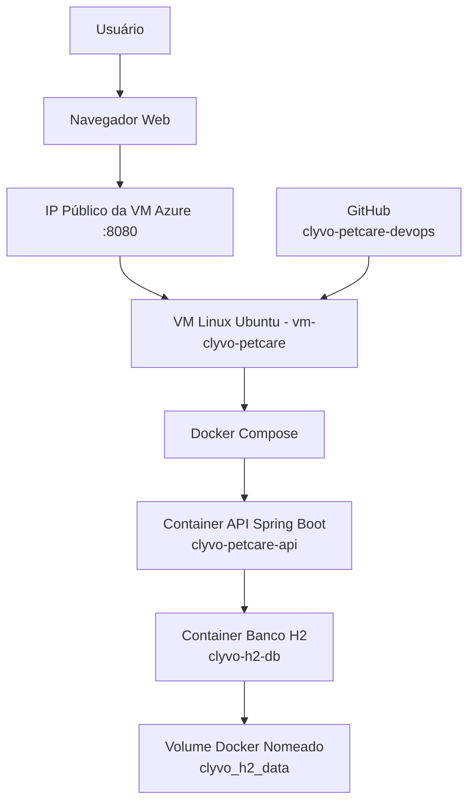

# Clyvo PetCare - DevOps

API REST desenvolvida em Java Spring Boot para apoiar a continuidade do cuidado veterinário, permitindo o cadastro de pets e a criação de alertas preventivos.

## Arquitetura Macro da Solução

A solução foi implantada em uma máquina virtual Linux na Microsoft Azure. O acesso externo ocorre pelo IP público da VM na porta 8080, permitindo acesso à API via Swagger.



## Link da aplicação em nuvem

```text
http://20.104.20.59:8080/swagger-ui.html
```

## Tecnologias

- Java 17
- Spring Boot
- Spring Data JPA
- H2 Database
- Swagger / SpringDoc OpenAPI
- Docker
- Docker Compose
- Microsoft Azure
- GitHub

## Execução com Docker Compose

```bash
docker compose up -d --build
```

## Verificar containers

```bash
docker ps
```

## Repositório

```text
https://github.com/Permagnani/clyvo-petcare-devops
```